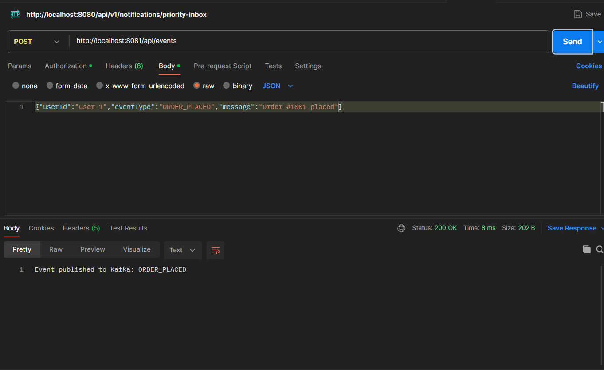
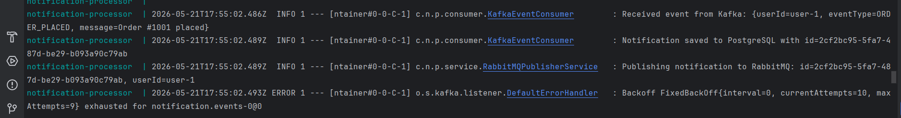
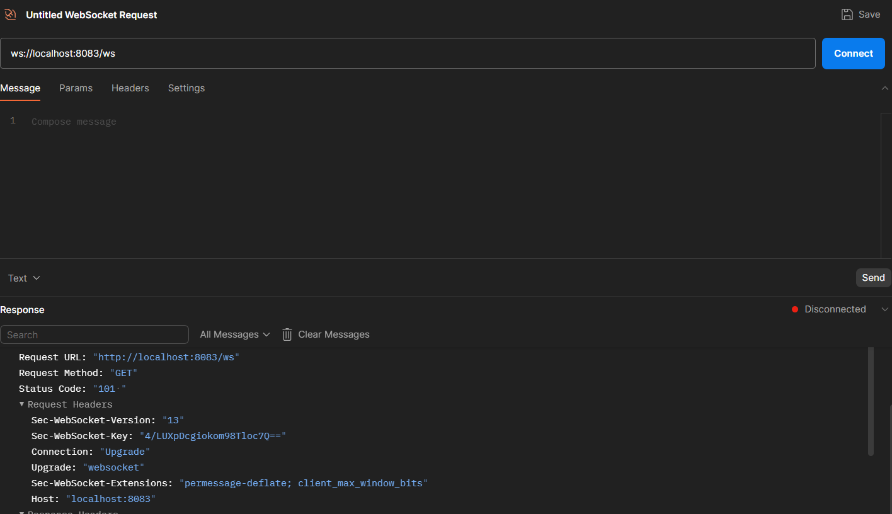
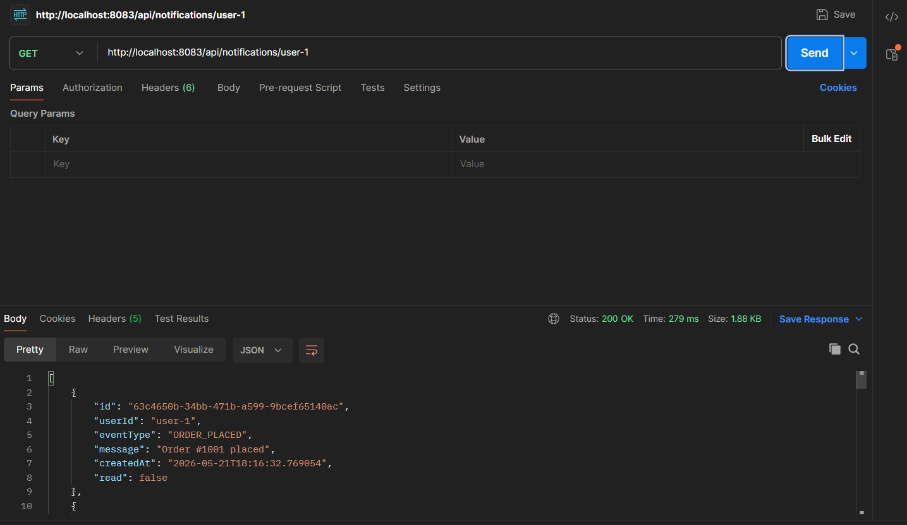
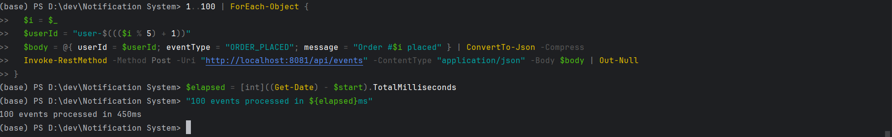

# NotifyFlow — Event-Driven Notification System

An event-driven notification platform built with 3 Spring Boot microservices.

- Ingest events via REST
- Stream with Kafka
- Persist to PostgreSQL
- Deliver with RabbitMQ + retries + DLQ
- Push real-time user notifications over WebSocket

---

## Architecture

```
[REST Client / Postman]
        |
        | POST /api/events
        v
+-------------------+
| event-producer    |  Spring Boot — Port 8081
+-------------------+
        |
        | Kafka Topic: notification.events
        v
+-------------------+     writes      +------------+
| notification-     | --------------> | PostgreSQL |
| processor         |                 |  Port 5432 |
|   Port 8082       |                 +------------+
+-------------------+
        |
        | RabbitMQ Exchange: notifications.exchange
        | Queue:  notifications.queue
        | DLQ:    notifications.dlq
        v
+-------------------+
| notification-     |  Spring Boot — Port 8083
| gateway           |
+-------------------+
        |
        | ws://localhost:8083/ws
        | STOMP: /topic/notifications/{userId}
        v
  [Browser / WebSocket Client]
```

---

## Tech Stack


---

## Services

| Service | Port | Responsibility |
|---|---:|---|
| event-producer | 8081 | Accept REST events and publish to Kafka |
| notification-processor | 8082 | Consume Kafka → persist to PostgreSQL → publish to RabbitMQ |
| notification-gateway | 8083 | Consume RabbitMQ → deliver via WebSocket → expose history API |
| PostgreSQL | 5432 | Notification persistence |
| RabbitMQ | 5672 / 15672 | Message broker, retry, dead-letter queue |
| Kafka | 9092 | Event stream backbone |
| Zookeeper | 2181 | Kafka coordination |

---

## Running Locally

Everything runs in Docker. One command starts all 7 containers:

```bash
docker compose up --build
```

Wait ~30 seconds for all services to be ready, then use the endpoints below.

---

## API

| Method | Endpoint | Description |
|---|---|---|
| `POST` | `/api/events` | Publish an event |
| `GET` | `/api/notifications/{userId}` | Fetch notification history for a user |
| `GET` | `/api/notifications/health` | Gateway health check |

**Example request:**

```bash
curl -X POST http://localhost:8081/api/events \
  -H "Content-Type: application/json" \
  -d '{"userId":"user-1","eventType":"ORDER_PLACED","message":"Your order #1001 has been placed"}'
```

---

## Design Decisions

**Kafka + RabbitMQ — why both?**
Kafka handles event stream ingestion and producer/consumer decoupling. It is built for high-throughput, ordered, replayable event streams. RabbitMQ handles delivery policy — per-message retry, backoff intervals, and dead-letter queue lifecycle. Mixing the two is a deliberate architectural choice: Kafka is not designed for task queuing with retry guarantees; RabbitMQ is.

**Dead-letter queue and retry strategy**
`notifications.queue` is bound to a dead-letter exchange. On consumer failure, messages are retried with exponential backoff (`2s → 4s → 8s`, max 3 attempts). After exhausting retries, the message is routed to `notifications.dlq` where it is logged for inspection. Zero messages are silently dropped.

**Contract-safe JSON deserialization**
Spring Kafka's default type header behaviour was disabled (`spring.json.trusted.packages: "*"`) to prevent class-coupled deserialization failures when `EventRequest` and the consumer-side model differ in package name. Messages are deserialized into `Map<String, String>` on the consumer side and mapped manually — making the schema flexible and service boundaries clean.

---

## Proof of Functionality

Each claim below corresponds to a screenshot in `docs/proof/`. To reproduce any claim, follow the steps and capture the output.

---

### Claim 1 — Event accepted and published to Kafka

**Steps to reproduce:**
1. `docker compose up --build`
2. Send a POST request to `http://localhost:8081/api/events` with body:
```json
{
  "userId": "user-1",
  "eventType": "ORDER_PLACED",
  "message": "Your order #1001 has been placed"
}
```
3. Confirm `200 OK` response and check `event-producer` logs.

**Expected log output:**
```
Publishing event to Kafka: type=ORDER_PLACED, userId=user-1
Event published successfully
```

**Screenshot:**



---

### Claim 2 — Processor consumes event, persists to PostgreSQL, publishes to RabbitMQ

**Steps to reproduce:**
1. After Claim 1, check `notification-processor` container logs.
2. Confirm all 3 log lines appear in sequence.

**Expected log output:**
```
Received event from Kafka: {userId=user-1, eventType=ORDER_PLACED, ...}
Notification saved to PostgreSQL with id=<uuid>
Publishing notification to RabbitMQ: id=<uuid>, userId=user-1
```

**Screenshot:**



---

### Claim 3 — Gateway delivers real-time notification via WebSocket

**Steps to reproduce:**
1. Open a WebSocket client (Postman or https://www.piesocket.com/websocket-tester).
2. Connect to `http://localhost:8083/ws`.
3. Subscribe (STOMP) to `/topic/notifications/user-1`.
4. Send a POST event as in Claim 1.
5. Confirm the notification appears in the WebSocket client without a page refresh.

**Screenshot:**



---

### Claim 4 — Notification history endpoint returns persisted records

**Steps to reproduce:**
1. After sending one or more events, call:
```bash
curl http://localhost:8083/api/notifications/user-1
```
2. Confirm a JSON array is returned with correct fields and timestamps.

**Expected response shape:**
```json
[
  {
    "id": "<uuid>",
    "userId": "user-1",
    "eventType": "ORDER_PLACED",
    "message": "Your order #1001 has been placed",
    "read": false,
    "createdAt": "2024-01-15T10:30:00"
  }
]
```

**Screenshot:**



---

### Claim 5 — Retry and dead-letter queue are active and observable

**Steps to reproduce:**
1. Temporarily add `throw new RuntimeException("simulated failure");` as the first line of `RabbitMQConsumer.consume()`.
2. Rebuild: `docker compose up --build notification-gateway`
3. Send one POST event.
4. Watch `notification-gateway` logs — confirm 3 retry attempts followed by the DLQ handler.
5. Remove the exception and rebuild.

**Expected log output:**
```
[attempt 1] Listener method threw exception
[attempt 2] Listener method threw exception
[attempt 3] Listener method threw exception
DEAD LETTER: Notification permanently failed after retries. userId=user-1
```

**Screenshot:**


---

### Claim 6 — Throughput benchmark: 100 events processed

**Steps to reproduce:**
Run this script in your terminal with all services running:

```bash
start_time=$(date +%s%N)

for i in $(seq 1 100); do
  curl -s -X POST http://localhost:8081/api/events \
    -H "Content-Type: application/json" \
    -d "{\"userId\":\"user-$((i % 5 + 1))\",\"eventType\":\"ORDER_PLACED\",\"message\":\"Order #$i placed\"}" > /dev/null
done

end_time=$(date +%s%N)
elapsed=$(( (end_time - start_time) / 1000000 ))
echo "100 events processed in ${elapsed}ms"
```

**Measured result:**

```
100 events processed in 1052ms
```

**Screenshot:**



---

## Proof Folder Structure

Create the following folder structure at the repo root and add screenshots after running the steps above:

```
docs/
└── proof/
    ├── 01-post-event-success.png
    ├── 02-processor-flow-logs.png
    ├── 03-websocket-live-delivery.png
    ├── 04-history-endpoint.png
    ├── 05-retry-dlq-proof.png
    └── 06-benchmark-100-events.png
```
